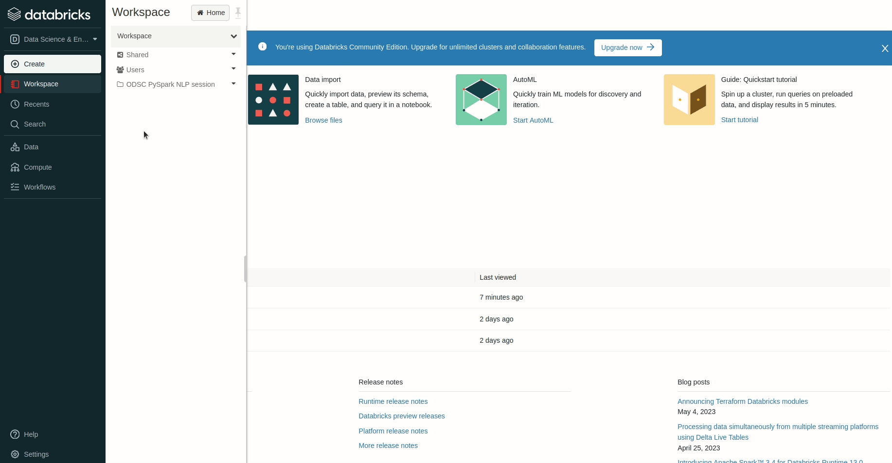

# PySpark NLP virtual workshop

Instructions and code for the workshop "From Big Data to NLP Insights: Unlocking the Power of PySpark and Spark NLP"

## Setup

### Databricks community edition

We will run the training code on Databricks Community Edition. Create your account by following the [instructions provided in the official documentation](https://docs.databricks.com/getting-started/community-edition.html). Please complete this step before moving forward.

### Databricks workspace

You can now create a Databricks workspace with the required Jupyter notebooks [using this link](). The steps for doing this can be seen in the below GIF.  

From the left-hand side navbar, click on `Workspace` > click on dropdown >  click on `Import` > choose `URL` option and enter the link > click on `Import`.

Voila! You're all set to start.

## Code

The workshop code is distributed across 3 Jupyter notebooks. Each of these correspond to a workshop module. They are:

- Module 1: Basics of PySpark and the DataFrame API
- Module 2: PySpark for NLP
- Module 3: Advanced NLP with Spark NLP

They should be in your workspace if you have successfully completed the setup steps. They are present in this repository too if you want to go through them after the workshop.

_Note: A conceptual introduction to Jupyter notebooks can be found [here](https://www.databricks.com/glossary/jupyter-notebook)._
